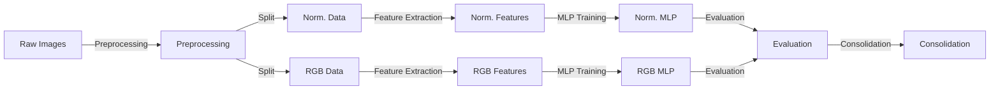
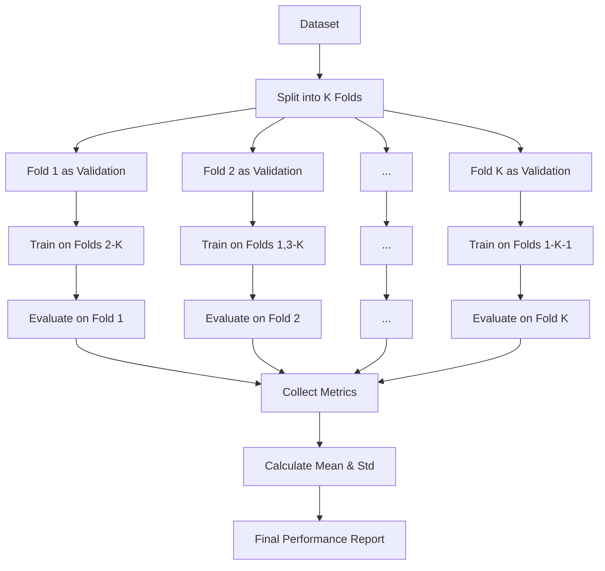

# Pipeline Overview

This document provides a detailed explanation of the UA-SLSM MLP Training Pipeline architecture and workflow.

## Pipeline Architecture

The UA-SLSM MLP Training Pipeline consists of two main stages:

1. **Feature Extraction**: Extract features from images using pre-trained models
2. **MLP Training**: Train MLP classifiers on the extracted features

### Feature Extraction Stage

The feature extraction stage uses pre-trained models to extract high-level features from images. These features are then used as input to the MLP classifiers.

```
Raw Images → Pre-trained Model → Feature Vectors → Saved Feature Files
```

#### Supported Feature Extractors

- **MobileNetV3**: Lightweight model with 960-dimensional features
- **ResNet18**: Medium-sized model with 512-dimensional features
- **ResNet50**: Larger model with 2048-dimensional features
- **EfficientNetV2-S**: Efficient model with 1280-dimensional features

### MLP Training Stage

The MLP training stage trains a classifier on the extracted features using cross-validation.

```
Feature Vectors → MLP Classifier → Trained Model → Evaluation Metrics
```

#### MLP Architecture

Each MLP classifier consists of:
- Input layer (size depends on feature extractor)
- Dropout layer (rate depends on model architecture)
- Hidden layers with ReLU activation (dimensions depend on model architecture)
- Output layer (binary or multi-class)

## Workflow

### 1. Feature Extraction

For each model architecture and data version:
1. Load pre-trained model
2. Process images through the model up to the final feature layer
3. Extract feature vectors
4. Save features to disk for later use

### 2. MLP Training

For each model architecture and data version:
1. Load extracted features
2. Initialize MLP classifier with model-specific hyperparameters
3. Perform k-fold cross-validation:
   - Train on k-1 folds
   - Validate on the remaining fold
   - Repeat for all folds
4. Generate evaluation metrics and visualizations
5. Save trained models and results

### 3. Results Consolidation

After training all models:
1. Collect metrics from all architectures and data versions
2. Calculate means and standard deviations
3. Generate a consolidated LaTeX table for comparison

## Data Flow



## Cross-validation

The pipeline uses k-fold cross-validation to ensure robust evaluation:

1. Dataset is split into k folds (default: 5)
2. For each fold:
   - Train on k-1 folds
   - Validate on the remaining fold
   - Calculate metrics (F1, Accuracy, AUC)
   - Generate visualizations
3. Calculate mean and standard deviation of metrics across folds

### Cross-validation Process



## Evaluation Metrics

The pipeline calculates and reports:

### Performance Metrics
- **F1 Score**: Harmonic mean of precision and recall
- **Accuracy**: Overall correctness percentage
- **AUC**: Area Under ROC Curve

### Efficiency Metrics
- **Parameter Count**: Number of trainable parameters
- **Training Time**: Average time per epoch
- **Inference Time**: Average time per batch

## Pipeline Execution

The pipeline is executed using shell scripts:

- `run.sh`: Runs specific stages for a particular model and data version
- `sweep.sh`: Runs the complete pipeline for all models and data versions


## Next Steps

- Learn how to [configure the pipeline](configuration.md)
- Understand [results analysis](results_analysis.md)
